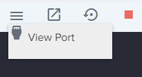

# Argo Server setup
_https://argoproj.github.io/argo-workflows/quick-start/_
[TOC]
## Setup:
1. Create a kubernetes single node cluster 
2. Create namespace for ago
3. Deploy required resources for argo server
4. Patch Server UI to allow no auth access
5. Port forward 2746 using port 80 to expose ui

```bash
alias k=kubectl
k create ns argo
k config set-context --current --namespace=argo
kubectl apply -n argo -f https://github.com/argoproj/argo-workflows/releases/download/v3.5.2/install.yaml
kubectl -n argo get deploy workflow-controller argo-server
kubectl -n argo wait deploy --all --for condition=Available --timeout 2m
```
## Install ARGO CLI

```bash
curl -sLO https://github.com/argoproj/argo-workflows/releases/download/v3.5.2/argo-linux-amd64.gz
gunzip argo-linux-amd64.gz
chmod +x argo-linux-amd64
mv ./argo-linux-amd64 /usr/local/bin/argo
argo version
```

### ARGO SERVER UI
The argo UI supports event driven automation using Arog Events. 
We will switch the authentication mode to server so that we can bypass the UI login for now.

`argo -n argo server --access-control-allow-origin=* --auth-mode=server`

Second: HTTPS
Additionally, Argo Server runs over https by default. This isn't compatible with Killercoda, so we will disable https at the same time.
```bash
kubectl patch deployment   argo-server   --namespace argo   --type='json' \
  -p='[{"op": "replace", "path": "/spec/template/spec/containers/0/args", "value": [
  "server",
  "--auth-mode=server",
  "--secure=false"
]},
{"op": "replace", "path": "/spec/template/spec/containers/0/readinessProbe/httpGet/scheme", "value": "HTTP"}
]'
```
If you check the deployment (argo-server): you will notice the change

```yaml
spec:
  containers:
  - args:
    - server
    - --auth-mode=server
    - --secure=false
#-----
    readinessProbe:
    failureThreshold: 3
    httpGet:
      path: /
      port: 2746
      scheme: HTTP
```
wait for deploy to rollout new pods

`kubectl -n argo rollout status --watch --timeout=600s deployment/argo-server`

### Port forward UI

`kubectl -n argo port-forward --address 0.0.0.0 svc/argo-server 2746:2746 > /dev/null &`

For kodekloud playground

`kubectl -n argo port-forward --address 0.0.0.0 svc/argo-server 80:2746 > /dev/null &`

click on hamburger menu and view port 80: 

### ACCESS UI using Bearer token:

If you want to automate tasks with the Argo Server API or CLI, you will need an access token. An access token is just a Kubernetes service account token.
To set up a service account for our automation, we need to create:

* A role with the permission we want to use.
* A service account for our automation user.
* A service account token for our service account.
* A role binding to bind the role to the service account.

In our example, we want to create a role for Jenkins so it can create, get and list workflows:

Create the role:
```bash
kubectl create role jenkins --verb=create,get,list --resource=workflows.argoproj.io --resource=workfloweventbindings --resource=workflowtemplates
```
Create the service account:

`kubectl create sa jenkins`

Bind the service account to the role:

`kubectl create rolebinding jenkins --role=jenkins --serviceaccount=argo:jenkins`

Now we can create a token:

`ARGO_TOKEN="Bearer $(kubectl create token jenkins)"`

Print out the token:

`echo $ARGO_TOKEN`

You should see something like the following:

>_Bearer eyJhbGciOiJSUzI1NiIsImtpZCI6..._

To use the token, you add it as an Authorization header to your HTTP request:

`curl http://localhost:2746/api/v1/info -H "Authorization: $ARGO_TOKEN"`

You should see something like the following:

>{"modals":{"feedback":false,"firstTimeUser":false,"newVersion":false}}...

Now you are ready to create an Argo Workflow using the API.

### Operations with Argo CLI
|Operation	|CLI Command|
|-----------|------------|
|Submit a workflow spec to Kubernetes |	argo submit example-spec.yaml |
|Display a list of current workflows |	argo list |
|Display information about a specific workflow	| argo get example-spec-xxx |
|Display logs for a workflow	| argo logs example-spec-xxx |
|Delete a workflow	| argo delete example-spec-xxx  |
